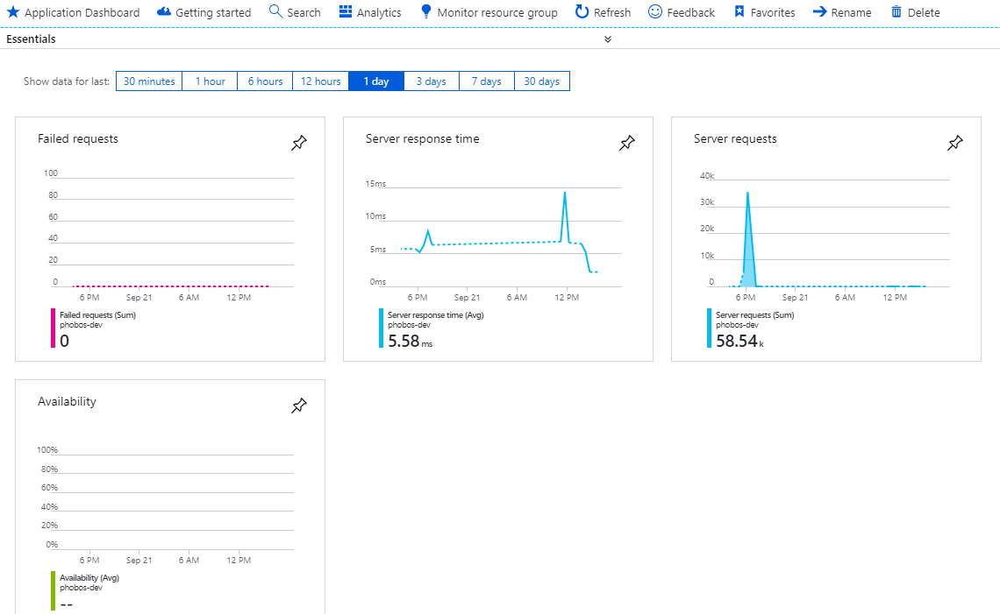
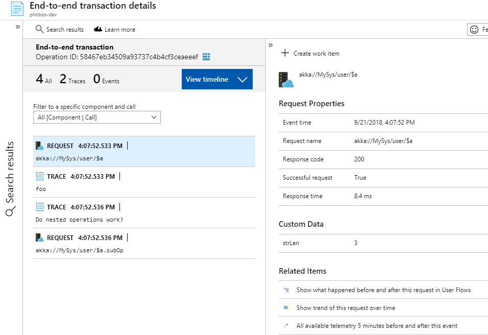

# Petabridge.Tracing.ApplicationInsights

This project is an [OpenTracing distributed tracing driver](http://opentracing.io/) built on top of [Microsoft's Application Insights](https://azure.microsoft.com/en-us/services/application-insights/) telemetry SDK. It is designed to allow developers consuming libraries and frameworks that expose the OpenTracing `ITracer` to be able to seamlessly swap in our `ApplicationInsightsTracer` as a vendor implementation if they so desire. 

This driver follows [the Application Insights to OpenTracing conventions](https://docs.microsoft.com/en-us/azure/application-insights/application-insights-correlation#open-tracing-and-application-insights) outlined by the Application Insights team.

`Petabridge.Tracing.ApplicationInsights` is professionally maintained and tested by [Petabridge](http://petabridge.com/) and is used inside some of our commercial products, such as [Phobos: Enterprise Akka.NET DevOps](https://phobos.petabridge.com/).

## Quickstart
To get started with `Petabridge.Tracing.ApplicationInsights`, install the NuGet package:

PS> Install-Package Petabridge.Tracing.ApplicationInsights

And then instantiate an instance of the `ApplicationInsightsTracer` class, like so:

```csharp
// use the active TelemetryConfiguration, if available
var tracer = new ApplicationInsightsTracer(TelemetryConfiguration.Active);

// record some new spans
using (var current = tracer.BuildSpan(Context.Self.Path.ToString()).StartActive())
{
    _loggingAdapter.Info(str);
    current.Span.Log(str);
    current.Span.SetTag("strLen", str.Length);

    using (var subOp = _tracer.BuildSpan(Context.Self.Path.ToString() + ".subOp").StartActive())
    {
        subOp.Span.Log("Do nested operations work?");
        subOp.Span.SetTag("nested", true);
    }
}
```

The output from this activity will show up as "Server Requests" in Application Insights:



> When using `ApplicationInsightsTracer`, if you want to record an operation as a "dependency" request, for instance if it's coming from a client app or driver, then make sure you call `ApplicationInsightsTracer.BuildSpan("operationName").WithSpanKind(SpanKind.CLIENT)`. This will change how the `ISpan` is recorded in Application Insights.

Each distributed trace, even across multiple services and devices, is correlated automatically in Application Insights:



From a correlation standpoint:

1. Each `ISpan` is recorded as either `Request` or `Dependency` telemetry inside Application Insights, depending upon which `SpanKind` was specified. By default it's `SpanKind.SERVER`, which correlates to `Request` telemetry.
2. Each `ISpan.Log` call in OpenTracing is recorded as a `Trace` event inside Application Insights.
3. OpenTracing `IScopeManager` and `IScope` still works as expected.
4. All `ISpan.SetTag` calls append tags to the current `Request` or `Dependency` telemetry.

## Building this solution
To run the build script associated with this solution, execute the following:

**Windows**
```
c:\> build.cmd all
```

**Linux / OS X**
```
c:\> build.sh all
```

If you need any information on the supported commands, please execute the `build.[cmd|sh] help` command.

This build script is powered by [FAKE](https://fake.build/); please see their API documentation should you need to make any changes to the [`build.fsx`](build.fsx) file.

### Conventions
The attached build script will automatically do the following based on the conventions of the project names added to this project:

* Any project name ending with `.Tests` will automatically be treated as a [XUnit2](https://xunit.github.io/) project and will be included during the test stages of this build script;
* Any project name ending with `.Tests` will automatically be treated as a [NBench](https://github.com/petabridge/NBench) project and will be included during the test stages of this build script; and
* Any project meeting neither of these conventions will be treated as a NuGet packaging target and its `.nupkg` file will automatically be placed in the `bin\nuget` folder upon running the `build.[cmd|sh] all` command.

### DocFx for Documentation
This solution also supports [DocFx](http://dotnet.github.io/docfx/) for generating both API documentation and articles to describe the behavior, output, and usages of your project. 

All of the relevant articles you wish to write should be added to the `/docs/articles/` folder and any API documentation you might need will also appear there.

All of the documentation will be statically generated and the output will be placed in the `/docs/_site/` folder. 

#### Previewing Documentation
To preview the documentation for this project, execute the following command at the root of this folder:

```
C:\> serve-docs.cmd
```

This will use the built-in `docfx.console` binary that is installed as part of the NuGet restore process from executing any of the usual `build.cmd` or `build.sh` steps to preview the fully-rendered documentation. For best results, do this immediately after calling `build.cmd buildRelease`.

### Release Notes, Version Numbers, Etc
This project will automatically populate its release notes in all of its modules via the entries written inside [`RELEASE_NOTES.md`](RELEASE_NOTES.md) and will automatically update the versions of all assemblies and NuGet packages via the metadata included inside [`common.props`](src/common.props).

If you add any new projects to the solution created with this template, be sure to add the following line to each one of them in order to ensure that you can take advantage of `common.props` for standardization purposes:

```
<Import Project="..\common.props" />
```